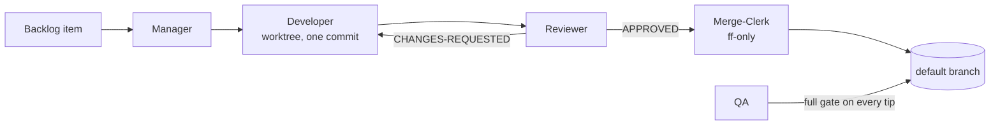

# claude-delivery-team

An autonomous, docs-driven software delivery team, packaged as a
[Claude Code](https://claude.com/claude-code) plugin. You file backlog items as
files in your repo; a team of subagents implements them in isolated git
worktrees, reviews each other's work, and lands fast-forward-only
commits. It has produced thousands of commits end-to-end, under human direction
but not human keystrokes.

## The idea: docs are the spec

The framework's central bet is that **documentation is the specification** and
everything else follows from it:

- Where a project declares docs-as-spec, a doc-vs-code mismatch means the
  *code* is wrong. Agents may sharpen a doc, but never re-decide one —
  decisions belong to the owner.
- A change that alters behaviour ships its spec edit **in the same commit**;
  a missing spec edit is a review defect, exactly like a missing test.
- The spec is **audited**: the `consistency-check` skill checks the docs
  against themselves, then the code against the docs, filing every confirmed
  delta as a backlog item.

The backlog itself follows the same principle — one file per item, priority in
the filename, deleted by the commit that merges the work. All work state lives
in git, not in anyone's memory.

## The team

Five roles, each deliberately narrow:

| Role | Does | Never |
|---|---|---|
| **Manager** | Triages the backlog, dispatches everyone else | Implements anything |
| **Developer** | One item, own worktree, one commit | Merges |
| **Reviewer** | Judges the change and independently re-verifies it | Writes — verdicts only |
| **Merge-Clerk** | Sole writer of code to the default branch, ff-only | Re-reviews — the Reviewer already did |
| **QA** | Runs the full gate on every new default-branch tip | Fixes — it files items |

Not every change pays for that pipeline: at intake, small single-area work is
routed down a **direct lane**, while risky work — auth, data-model,
cross-cutting, multi-phase — takes the **team lane** through the full path:



Because only the Merge-Clerk lands code, history stays linear and every commit
traces to a reviewed item. And because state is branches, worktrees, and
backlog files, any agent that dies is simply relaunched and reconstructs its
world from git.

Opt-in extras — an `engine-supervisor` that routes implementation through an
external coding CLI (fully contained: a run without one configured never sees
it), plus `exploration` and `ui-inspector` specialists — live in `agents/`.

## Get started

Install the plugin (the repo is its own single-plugin marketplace):

```
/plugin marketplace add dipeshc/claude-delivery-team
/plugin install delivery-team@claude-delivery-team
```

Then, in each project you want the team to work on:

1. Copy `docs/project-profile.template.md` to `<repo>/.claude/project-profile.md`
   and fill it in — quality-gate commands, backlog location, and whether your
   docs are the spec.
2. Create the backlog directory and file an item or two.
3. Run `/delivery-team:team`.

The Manager takes it from there; a status heartbeat keeps you posted, and you
stay in the loop for owner decisions and blocked items. You'll need a git repo
and a frontier model for the judgment roles (Manager, Reviewer, Merge-Clerk,
QA) — developers can run on mid-tier models.

## Going deeper

The details live in the docs, which are this repo's own specification — it
runs its own process on itself, backlog and all:

- [`docs/architecture.md`](docs/architecture.md) — what each component is and
  the eight invariants that bind them. The entry point.
- [`docs/team-charter.md`](docs/team-charter.md) — the shared rules every
  agent obeys: lanes, writers, verification, message schemas.
- [`docs/project-profile.template.md`](docs/project-profile.template.md) —
  the per-project configuration template.

## License

MIT
