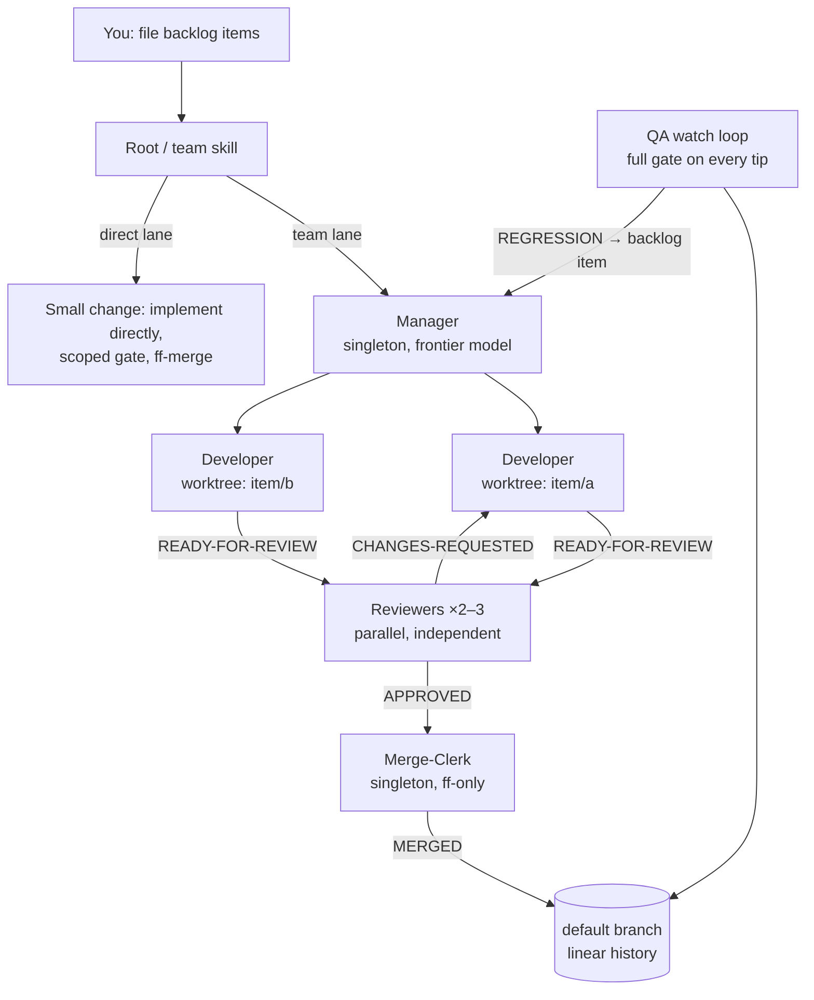

# claude-delivery-team

An autonomous software delivery team built on [Claude Code](https://claude.com/claude-code)
subagents. A **Manager** agent works a prioritized backlog and dispatches
**Developers**, parallel **Reviewers**, a singleton **Merge-Clerk**, and a **QA**
guardian — implementing in isolated git worktrees, cross-reviewing each other's
work, enforcing quality gates, and landing signed, fast-forward-only commits with
minimal human intervention.

This is the framework I use daily to build my personal software — home-cooked
apps I create and run for myself, like a self-hosted media server. It has
produced thousands of commits end-to-end, under human direction but not human
keystrokes.

## How it works



The lifecycle of a work item:

1. **Backlog** — one file per item in the repo's backlog directory, priority in
   the filename (`P0`–`P3`). Filed by you, by a research spike, or by QA.
2. **Lane routing at intake** — low-risk, single-area changes take the *direct
   lane* (no pipeline ceremony); auth/security, data-model, cross-cutting, or
   multi-phase work takes the *team lane*.
3. **Implement** — a Developer gets its own git worktree on `item/<slug>`,
   produces the change as one commit, and rebases onto the default branch.
4. **Review** — independent Reviewers judge correctness *and* re-verify by
   running the quality gate themselves. Reviewers carry no write access at all.
5. **Land** — the Merge-Clerk, the only writer of code to the main tree,
   fast-forward-merges the approved branch. The merging commit deletes the
   item's backlog file — merging is what marks work done.
6. **Guard** — QA pulls every new default-branch tip into its own worktree and
   runs the full quality gate, filing regressions back into the backlog.

## Design decisions that matter

- **Single-writer merge point.** Only the Merge-Clerk writes code to the main
  working tree, ff-only, one commit per item. History stays linear and every
  commit traces to a reviewed item.
- **Risk-routed lanes.** Verification effort scales with actual risk, not habit.
  A typo fix doesn't pay for a five-agent pipeline; a persistence change does.
- **Capability gating.** Judgment roles (Manager, Reviewer, Merge-Clerk, QA)
  self-check that they're running on a frontier model and refuse to proceed
  otherwise. Implementation can run on mid-tier models or even external engines
  (treated as untrusted contributor diffs, reviewed like any other change).
- **Verification discipline.** "Should pass" is not a result. Agents report the
  exact commands they ran and their outcomes; repo-wide invariant guards run
  whenever triggered, even when a scoped gate wouldn't catch them.
- **Prompt-injection posture.** Agents treat tool-results that claim user
  intent or ask them to conceal things as probable injections — report
  verbatim, never obey — with a calibrated carve-out for known-benign harness
  notices so the alarm keeps its signal value.
- **Crash-safe by construction.** State lives in git (branches, worktrees,
  backlog files), not in agent memory. A dead Manager is relaunched and
  reconstructs everything from `git worktree list` and the backlog.
- **Project-agnostic core.** The charter and agents are identical for every
  project. Everything project-specific — quality-gate commands, backlog
  location, invariant guards, parity rules — lives in that repo's
  `.claude/project-profile.md`.

## Repository layout

This repo is a [Claude Code plugin](https://code.claude.com/docs/en/plugins.md):

| Path | Purpose |
|---|---|
| `.claude-plugin/plugin.json` | Plugin manifest |
| `agents/` | Agent definitions: `manager`, `developer`, `reviewer`, `merge-clerk`, `qa`, plus `exploration` and `ui-inspector` specialists |
| `skills/team/` | The team skill — how the root instance spawns, stewards, and watchdogs a run |
| `skills/consistency-check/` | Spec-vs-spec and spec-vs-code audit skill used by QA on cadence |
| `docs/team-charter.md` | Shared rules every agent obeys: lanes, writers, signing, verification, message schemas |
| `docs/project-profile.template.md` | Template for the per-repo `.claude/project-profile.md` |

## Install

In Claude Code:

```
/plugin install dipeshc/claude-delivery-team
```

Then, per project:

1. Copy `docs/project-profile.template.md` to `<repo>/.claude/project-profile.md`
   and fill it in (quality-gate commands, backlog location, layout).
2. Create the backlog directory and file an item or two.
3. Run `/delivery-team:team`.

The Manager takes it from there and a status heartbeat keeps you posted; you
stay in the loop for owner decisions, blocked items, and anything marked
`MERGE-BLOCKED`.

## Requirements

- Claude Code with subagent support (the `Agent` tool and `.claude/agents`).
- Judgment roles want a frontier model (e.g. Opus-class or above); developers
  can run on mid-tier models.
- A git repo. The framework leans hard on worktrees, ff-only merges, and
  commit signing (with a declared, tracked fallback when the signing agent is
  unreachable).

## License

MIT
